# Get To It

A free, private to-do app for macOS and Windows: to-do lists, grocery lists,
habit lists and rich-text notes. Everything is stored on your computer: there
is no account, no sync service and no telemetry.

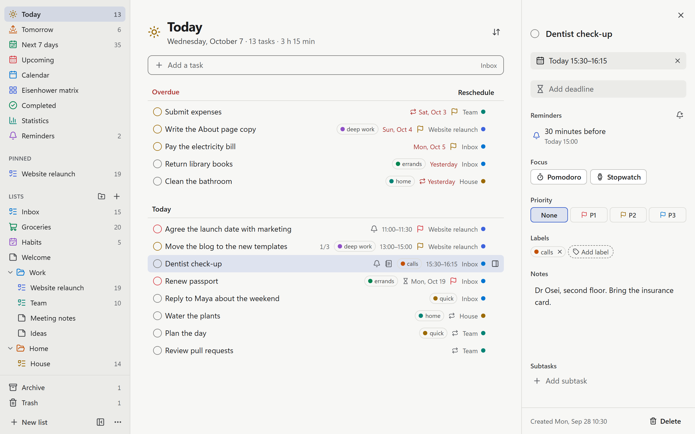

## Features

- **Tasks** with subtasks, sections, due dates, repeats, reminders, priorities
  and labels. Dates can be typed in plain words ("tomorrow 3pm").
- **Views** for Today, Tomorrow, Next 7 days, Upcoming, a calendar, a priority
  matrix, saved filters, completed tasks and stats.
- **Boards:** show a list or view as a board, with columns by date, priority,
  list or label. Dragging a card to another priority column changes its
  priority.
- **Grocery lists** sorted by category, with quantities and a cart.
- **Habit lists** and **rich-text notes** with headings, lists, checklists and
  links.
- **Focus timer:** start a Pomodoro or a stopwatch on any task.
- **Keyboard first:** a command palette (`Ctrl/⌘ K`), search, multi-select,
  undo and redo, and a shortcut for nearly everything.
- **Five colour schemes** (Graphite, Paper, Moss, Plum and High contrast) and
  window zoom from 80% to 200%.
- **Your data stays yours:** daily automatic backups, export to JSON or
  Markdown, and import from a JSON export.

## Screenshots

A list with sections, subtasks, labels and priorities:


The same list as a board, grouped by priority:

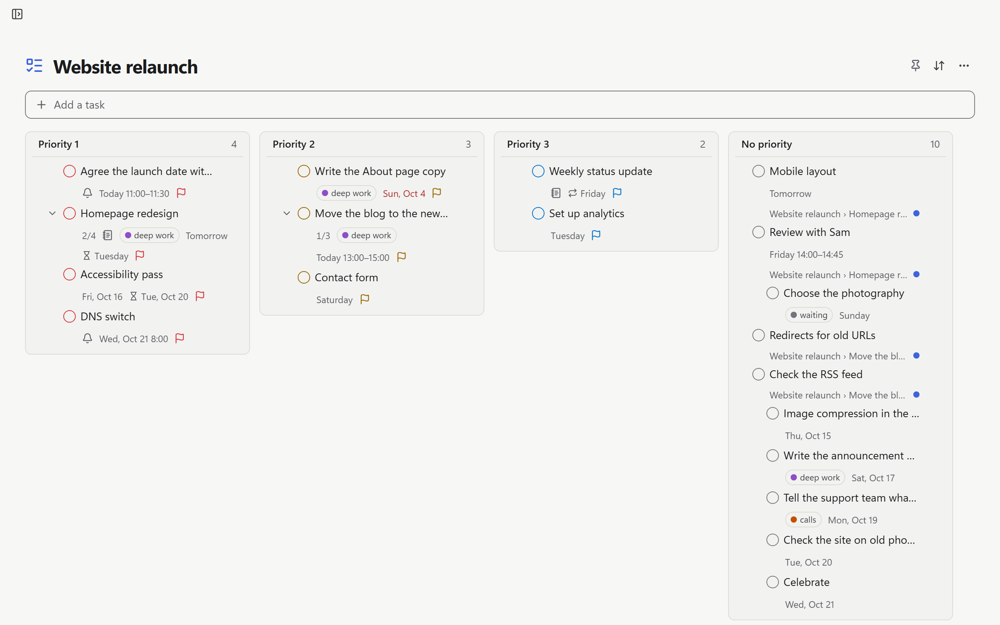

The calendar week:

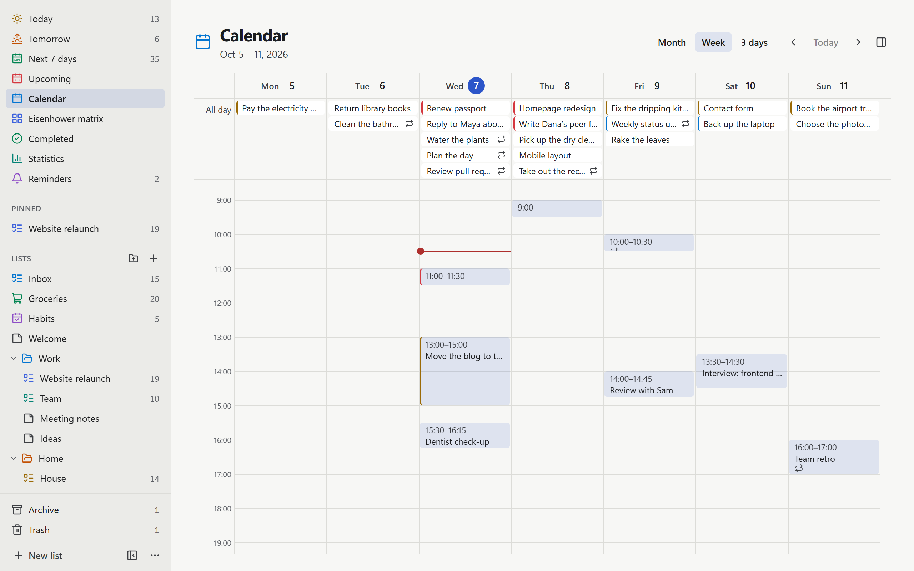

A grocery list, sorted by category, with a cart:

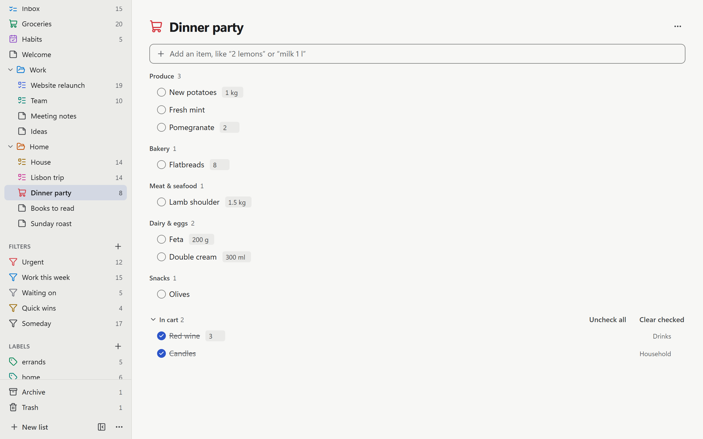

A rich-text note:

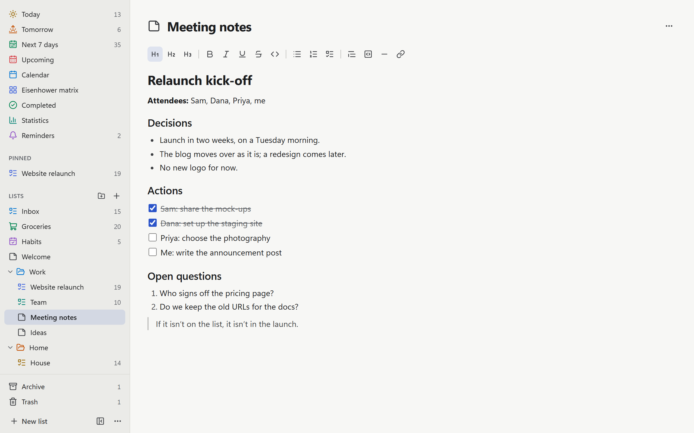

The command palette:

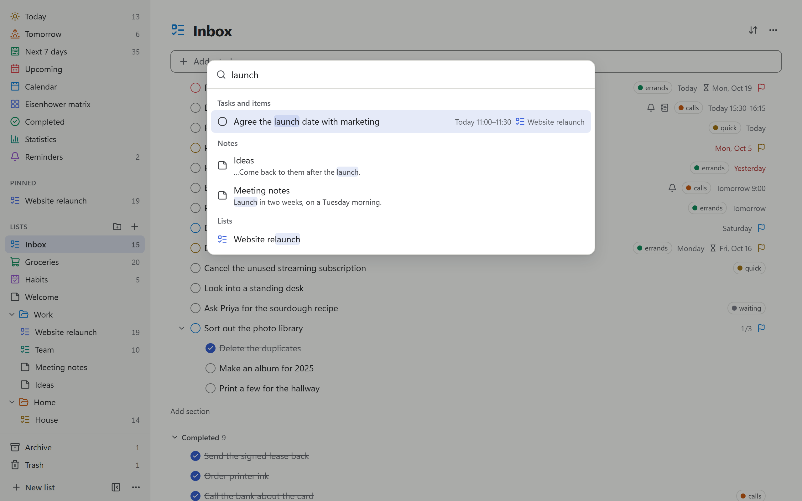

The five colour schemes: Graphite, Paper, Moss, Plum and High contrast.

<p>
  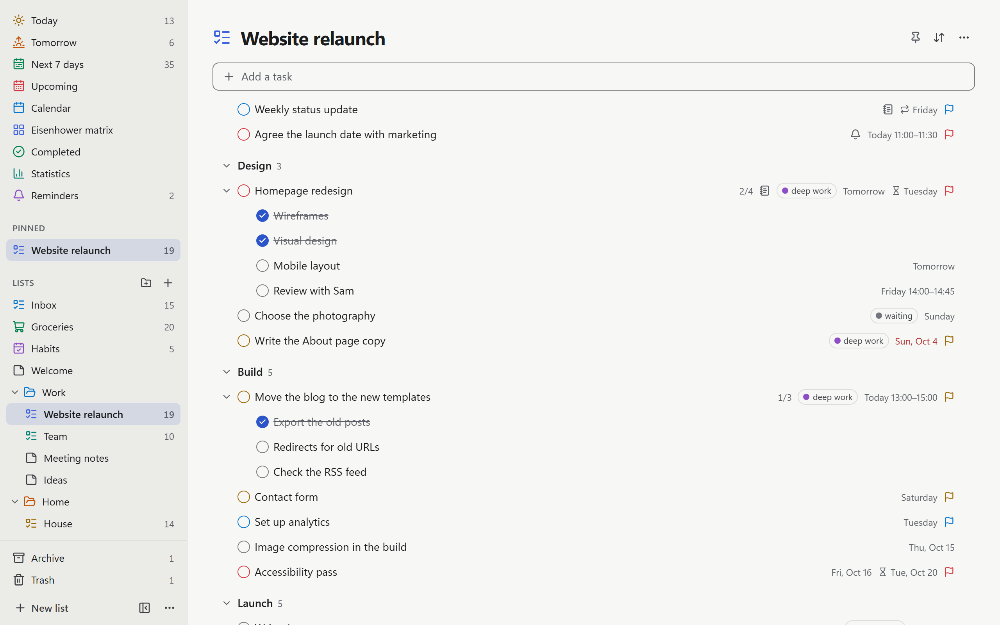
  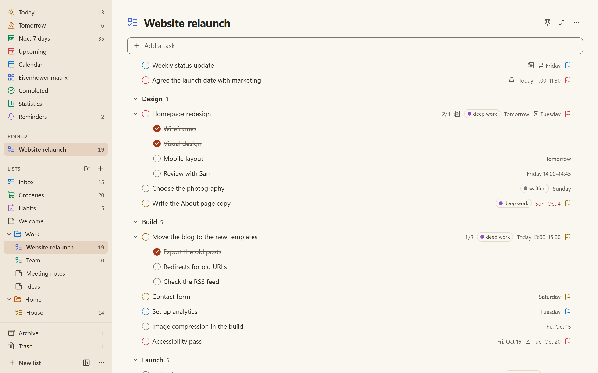
  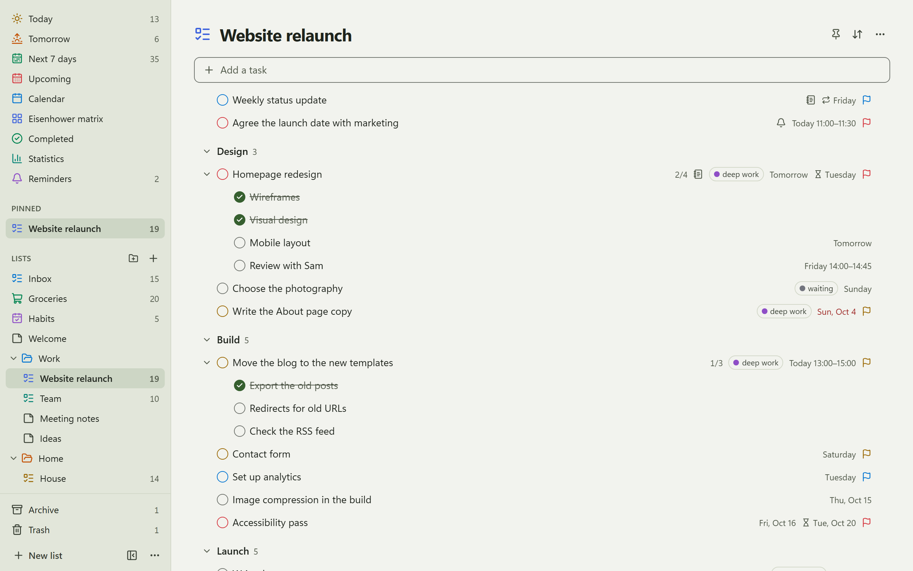
  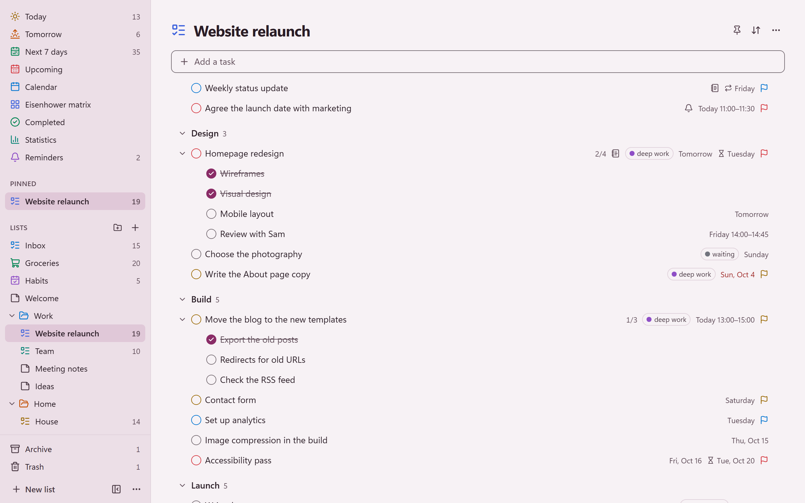
  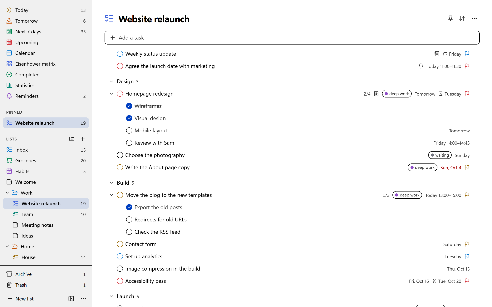
</p>

To make these again, run `npm run screenshots`.

## Install

Download the latest installer from the
[Releases page](https://github.com/largepelotas/get-to-it/releases):

- **macOS 11 or later** (Apple silicon and Intel): the `.dmg`
- **Windows 10 or 11, 64-bit:** the `.exe`

Linux isn't packaged or tested yet.

The builds aren't signed with a developer certificate, so first launch needs
one extra step:

- **macOS:** open Get To It once (it will be blocked), then go to **System
  Settings → Privacy & Security** and click **Open Anyway** next to the
  message about Get To It. On macOS 14 and earlier, right-clicking the app
  in Applications and choosing **Open** also works.
- **Windows:** in the SmartScreen prompt, click **More info → Run anyway**.

There is no automatic update. To update, download the newer installer and run
it; your data is kept. **Settings → About** shows the version, links to check for
a newer one, and the licences of the libraries Get To It is built with.

## Your data

Get To It never connects to the internet. The only thing that leaves the app
is a link you click, which opens in your browser or mail app. (On Windows, the
installer downloads Microsoft's WebView2 runtime if the PC doesn't have it.)

Data lives in a SQLite database, `gettoit.db`, in the app's data folder:

- **Windows:** `%APPDATA%\com.largepelotas.gettoit\`
- **macOS:** `~/Library/Application Support/com.largepelotas.gettoit/`

Once a day the app writes a JSON backup into the `backups` folder there and
keeps the newest 14. **Settings** has **Back up now** and **Show backups**. To
restore, use **Import** and choose a backup file; importing replaces what's in
the app, and a backup is made first.

## Keyboard shortcuts

`Ctrl/⌘ /` in the app shows the full list. The main ones (`Mod` is `Ctrl` on
Windows and `⌘` on macOS):

| Keys                        | Action                              |
| --------------------------- | ----------------------------------- |
| `Mod K`                     | Search and run commands             |
| `Mod F`                     | Search                              |
| `Mod N`                     | Add a task or item                  |
| `Mod Shift N`               | New list                            |
| `Mod 1` / `2` / `3`         | Go to Today, Upcoming or Reminders  |
| `Mod Z` / `Mod Shift Z`     | Undo, redo                          |
| `Mod \`                     | Hide or show the sidebar            |
| `Mod =` / `Mod -` / `Mod 0` | Zoom in, zoom out, back to 100%     |
| `Space` or `E`              | Complete the selected task          |
| `Tab` / `Shift Tab`         | Make a subtask, or move it back out |
| `T` or `Mod D`              | Set the due date                    |
| `1` `2` `3` `4`             | Set priority 1, 2 or 3, or none     |
| `L` / `V`                   | Labels, move to another list        |
| `F` / `Shift F`             | Start a Pomodoro or a stopwatch     |

## Building from source

You need [Node.js](https://nodejs.org) 22.12 or later,
[Rust](https://rustup.rs) 1.90 or later, and the
[Tauri prerequisites](https://tauri.app/start/prerequisites/) for your system
(a C compiler, and WebView2 on Windows).

```sh
npm ci
npm run dev        # browser preview at http://localhost:1420
npm run app:dev    # desktop app
npm run app:build  # installer for this computer
npm run notices    # third-party licence notices (app:build runs it for you)
npm test           # unit tests
npm run test:e2e   # end-to-end tests (first: npx playwright install chromium)
```

In development a new data set starts with sample data (lists, tasks, habits,
notes and a year of history) instead of the starter lists. `npm run app:dev`
keeps its database in a `dev` folder inside the app's data folder, apart from
an installed copy's. The dates are worked out on the day the data is made;
**Reset sample data** in the command palette makes a fresh set.

Installers are built by the **Build installers** workflow, for each version
tag or when it's run by hand. A tag (`v1.0.0`) also gets a draft release with
the installers attached.

More about the code:

- [Architecture](docs/ARCHITECTURE.md): how it's built, the decisions behind it and known gaps

## License

[MIT](LICENSE)
